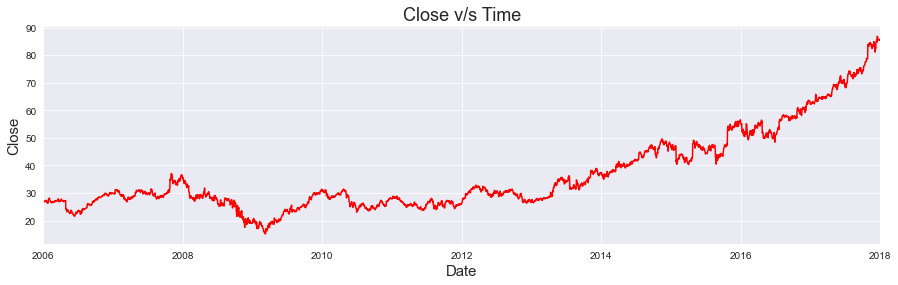
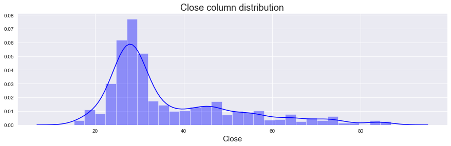
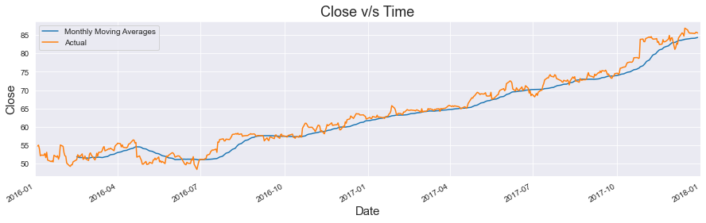
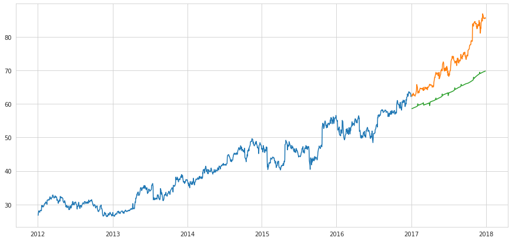
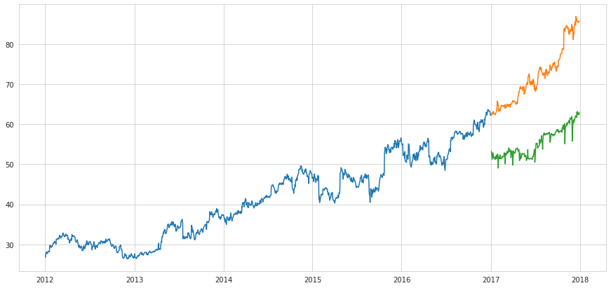
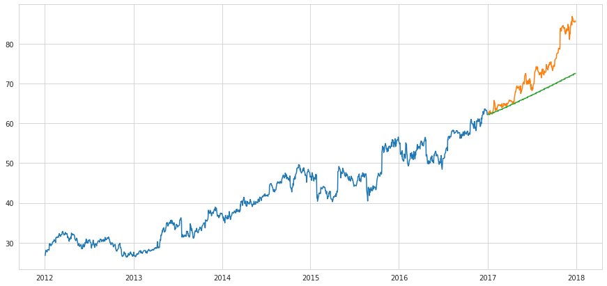
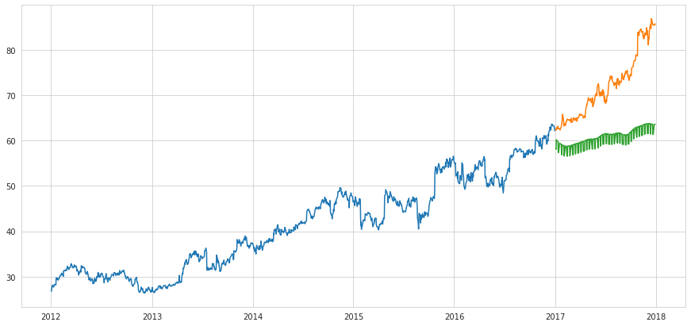
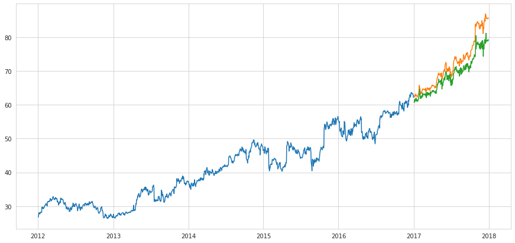
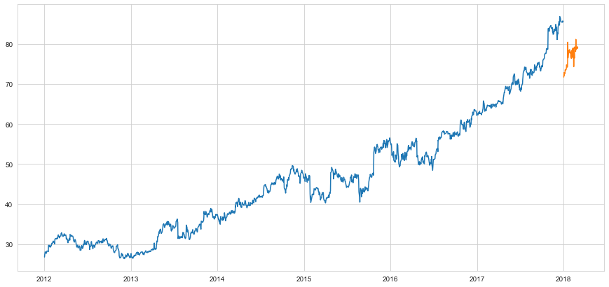

# <ins>Stock Market Analysis and Prediction</ins>

Stock market analysis enables investors to identify the intrinsic worth of a security even before investing in it. All stock market tips are formulated after thorough research by experts. Stock analysts try to find out activity of an instrument/sector/market in future.

By using stock analysis, investors and traders arrive at equity buying and selling decisions. Studying and evaluating past and current data helps investors and traders to gain an edge in the markets to make informed decisions. Fundamental Research and Technical Research are two types of research used to first analyze and then value a security.

## Project Overview:

This project mainly focuses on Stock market analysis and prediction of one of the Tech Giants in the Industry , Microsoft.

The dataset that is used is a part of DJIA Stock time series datset from kaggle. The dataset can be found [here](https://www.kaggle.com/szrlee/stock-time-series-20050101-to-20171231).

#### Goal of this project:

To analyze the trend of Microsoft Stock market and predicting the future stock of the company.

### Outcome: 

Predicted one year of future stock of the company with a root-mean squared error of  3.50.

## Resources:

**Python version :** 3.7
**Packages Used:** pandas, numpy, matplotlib, seaborn, sklearn, tensorflow, pyramid-arima, fbprophet

## Project Architecture:

- **Dataset Description**

    - Features : Open, High, Low, Close, Volume

- **Exploratory Data Analysis**

    - Visualization of feature trends in a time-series
    - Plotting graphs of features to find any meaningful insight

- **Data Preprocessing**

    - Different feature creation on dates
    - Handling categorical values
    - Moving average feature generation

- **Model Building and Testing**

    - Trying out four different models.
    - Validating model performance on Validation data
    - Evaluating performance based on root-mean squared error

- **Testing**

    - Generating 1 month of new stock data

### Exploratory Data Analysis:

Associated [Notebook](https://github.com/PritamAich/Stock-Market-Prediction/blob/master/Microsoft%20Stock%20market%20time%20series%20analysis.ipynb)

a) Firstly, the data is gathered.

b) Then different experimental visualizations were done to get any meaningful insight.

Some of the visualization done on this time-series data are shown below:

- General trend of the closing price:

The Closing price of stocks follows a general trend upto 2012, after that it shows an increasing trend which is notable.

- Distribution of stock prices throughout the timeline:

Closing price of stock mostly ranges between 20 and 40 dollars.

- Moving Average of closing price:

The moving average for the closing price of the stock is calculated with a window period of 1 month.

There is also some interactive visualizations on the stock data using Plotly. It can be found in [this notebook](https://github.com/PritamAich/Stock-Market-Prediction/blob/master/Plotly%20Visualization%20on%20MSFT%20Stock%20market%20anlysis.ipynb).

### 2. Data Preprocessing:

Associated [Notebook](https://github.com/PritamAich/Stock-Market-Prediction/blob/master/Data_Preprocessing.ipynb)

Data processing is done in various steps.

 - First different features are created based on the Date, like ‘Year’, ‘Month’, ‘Week’, ‘Day’, ‘Dayofweek’, ‘Dayofyear’, ‘Is_month_end’, ‘Is_month_start’, ‘Is_quarter_end’, ‘Is_quarter_start’, ‘Is_year_end’, and ‘Is_year_start’, using fastai framework.

- Then categorical values(mainly True and False) are converted into binary values using LabelEncoder from sklearn package.

- Moving average is calculated for the closing price of stock with a window of 30 days(one month)

- Another feature is created called Expanding moving average takes all the past values into account.

### 3. Model Building:

The main motive here is to predict one year of stock price of Microsoft along with profit and loss.

The profit or loss calculation is usually determined by the closing price of a stock for the day, hence we will consider the closing price as the target variable.

The evaluation metric used is root-mean squared error.

Associated [Notebook](https://github.com/PritamAich/Stock-Market-Prediction/blob/master/Model.ipynb)

- At first, two base models were used for predictions on our dataset.

    - Linear Regression:

    

    Linear Regression failed to capture the seasonality and only captured the increasing trend, It didn't perform well.

    Root-mean squared error score = 9.235

    - K-Nearest Neighbors

    

    Just like Linear regression, KNN also failed to capture the seasonality and hence performed poorly.

    Root-mean squared error score = 17.170

    So, regression models are poor choices for a time-series datset like this.

- Next, three advanced level models are used that are specifically designed for time-series predictions.

    - Auto-ARIMA (Autoregressive integrated moving average)

    

    ARIMA model uses past data to understand the pattern in the time series. Using these values, the model captured an increasing trend in the series, but does not focus on the seasonal part.

    Root-mean squared error score = 6.354

    - Prophet

    

    Prophet (like most time series forecasting techniques) tries to capture the trend and seasonality from past data.

    Root-mean squared error score = 12.832

    Since stock prices heavily depend on other factors as well,  models like ARIMA and Prophet are not a good fit for our particular dataset.

    - Long Short Term Memory (LSTM)

    

    LSTM performed really well on this dataset and was actually able to predict the correct trend of the stock prices.

    LSTMS takes into account the past values that are important and forgets about those values that are not important and hence it outperformed other models in this aspect.

    Root-mean squared error score = 3.507

### 5. Testing

With our model, we predicted into the unknown future, the next two months of stock data.

Associated [Notebook](https://github.com/PritamAich/Stock-Market-Prediction/blob/master/Future%20forecasting.ipynb)

The model seems to perform really well on predicting new stock prices.

## Conclusion

Time series forecasting is a very intriguing field to work with, as well as it s a must for every company to understand seasonality, cyclicality, trend and randomness in the sales and other attributes.

And talking about stock market time-series analysis and predictions, LSTM performes better than most other algorithms.
